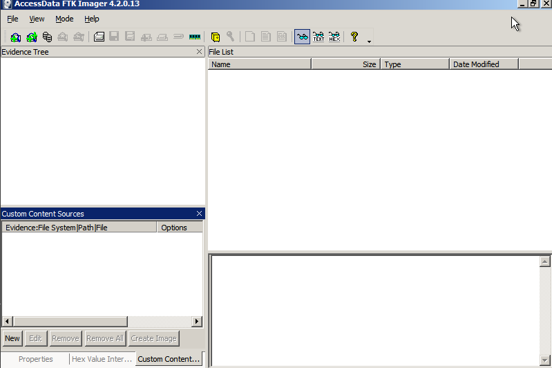
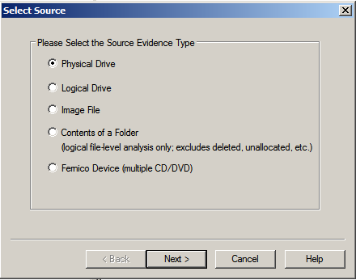
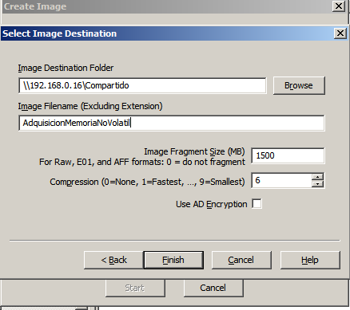
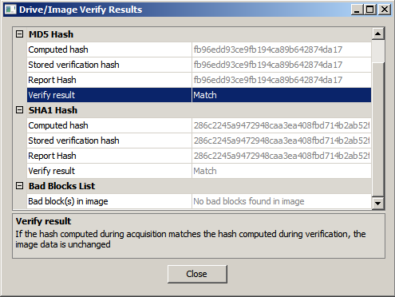
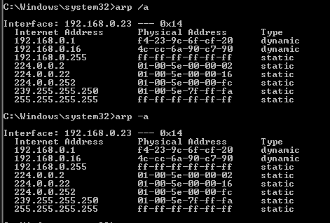

## Recolección y almacenamiento de evidencias
## Índice

1. [Recolección y almacenamiento de evidencias](#recolección-y-almacenamiento-de-evidencias)
   - [Recolección de la evidencia](#recolección-de-la-evidencia)
   - [Aplicación de *RFC 3227* e *ISO/IEC 27037*](#aplicación-de-rfc-3227-e-isoiec-27037)

2. [Preservación de la escena](#preservación-de-la-escena)
   - [Aseguramiento del equipo comprometido](#aseguramiento-del-equipo-comprometido)
   - [Restricción del acceso físico](#restricción-del-acceso-físico)
   - [Implementación de control de acceso](#implementación-de-control-de-acceso)

3. [Identificación de dispositivos](#identificación-de-dispositivos)

4. [Documentación inicial](#documentación-inicial)

5. [Captura de datos volátiles](#captura-de-datos-volátiles)

6. [Adquisición de datos no volátiles](#adquisición-de-datos-no-volátiles)

7. [Tablas de enrutamiento y caché ARP](#tablas-de-enrutamiento-y-caché-arp)

8. [Tabla de procesos en ejecución](#tabla-de-procesos-en-ejecución)

9. [Recolección de dispositivos](#recolección-de-dispositivos)

10. [Almacenamiento seguro](#almacenamiento-seguro)

11. [Cadena de custodia](#cadena-de-custodia)

### Recolección de la evidencia
Describir cada paso según metodología.

Aplicando nuestra metología basada en *RFC 3227* e *ISO/IEC 27037*, seguimos una serie de etapas necesarias para la adquisición de la evidencia digital:

#### Preservación de la escena

- Aseguramos el equipo comprometido de la red para evitar cualquier alteración de datos, es decir, desconectamos el cable de red. 
- Además de restringir el acceso físico al área donde está situado y documentamos quién tiene acceso a la escena y al equipo.
- Implementamos un control de acceso, de modo que solo haya una entrada y una salida para poder vigilar el flujo de personas.
  
#### Identificación de dispositivos

En esta etapa, determinamos que el análisis forense se centrará exclusivamente en el equipo del departamento de IT ubicado en la red interna de la empresa. Este equipo fue identificado como el punto principal de un posible compromiso ante los reportes de actividad sospechosa. El alcance de la investigación se ha limitado a este dispositivo hasta que se obtenga evidencia adicional. Una vez se obtenga, se evaluará si es necesario ampliar la investigación a otros sistemas.

#### Documentación inicial

Documentamos la presencia del dispositivo en la escena, así como el estado del mismo:

Descripción del dispositivo:

   - Tipo de dispositivo: Ordenador portátil
   - Marca: HP
   - Modelo: HP 250 G7 Notebook PC
   - Número de serie: CND13240JW
   - Estado del dispositivo: Encendido y en buen estado
  
Recolección:

   - Fecha: 08/11/2024
   - Hora: 17:55 hrs
   - Lugar de recolección: Departamento de IT
  
Recolector:

   - Nombre completo: Pablo Olvera Colino
   - Cargo/Institución: Técnico informático

#### Captura datos volátiles

Este es el estado en el que se encuentra el equipo inicialmente.

Extraemos la memoria volátil mediante la herramienta RAMCapturer. 

Antes que nada, creamos una carpeta compartida en el anfitrión para que pueda verse en toda la red. Tiene todas las herramientas necesarias para nuestra tarea.

Accedemos mediante la IP o el nombre del equipo.

Entramos a la carpeta compartida sin problemas y, de esta forma, no alteramos la integridad de la unidad de disco que hay en uso en la máquina.

Realmente, lo más acertado sería usar un pendrive conectado a la máquina virtual pero no ha sido posible debido a los drivers. Así que optamos por una carpeta compartida con todo lo necesario y para poder recolectar las evidencias.

Ahora, vamos donde esta ubicada la carpeta de la herramienta RAMCapturer y la copiamos en el escritorio porque no es posible realizarlo desde la carpeta de red.

La ejecutamos como administrador y hacemos doble clic sobre el ejecutable.

Nos detecta la RAM del sistema, 4 Gb y hacemos clic en *Capture!*

Una vez finalizada, cerramos el programa y nos ha generado el archivo de la adquisición de la memoria.

Lo copiamos en la carpeta compartida y calculamos el hash MD5 en el anfitrión.

Para calcularlo usamos un comando de PowerShell.

      get-filehash -algorithm md5 .\20241109.mem

Descripción de la evidencia:

- Tipo de evidencia: Captura de memoria RAM
- Archivo de salida: 20241109.mem
- Hash MD5: BC2FBF0079E5898B59A72F57DA222661
- Tamaño del archivo: 1.063.004.406 bytes
- Método de adquisición: RAMCapturer
- Fecha y hora de adquisicón: 
   - Creado: 21:55 09/11/2024
   - Modificado: 21:50 09/11/2024
   - Último acceso: 21:55 09/11/2024
- Investigador: Pablo Olvera Colino
- Destino de almacenamiento: Carpeta compartida

#### Adquisición de datos no volátiles

Creación de imágenes forenses: Capturamos la imagen del disco con FTKImager preservando la integridad de los datos mediante el uso de los hashes MD5 y SHA-1.

Este sí debemos instalarlo para su funcionamiento en la máquina.

Ejecutamos el acceso directo que se ha creado.

Le damos a *Create disk image*.

La fuente de la evidencia es física porque queremos una copia completa y exacta del disco.

Seleccionamos el tipo de imagen en formato E01, ya que nos permite la compresión de la imagen y la inclusión de metadatos (cadena de custodia, hashes, etc.).

La carpeta de destino es la carpeta compartida.

Finalmente obtenemos los siguientes resultados:

Descripción de la evidencia:

- Imagen de disco completo físico
- Dipositivo de Origen: Disco duro interno de la máquina comprometida del departamente de IT.
- Sistema de Archivos: NTFS
- Tamaño de la imagen: 5189905408 bytes
- Formato de la imagen: E01
- Hash: 
   - MD5:fb96edd93ce9fb194ca89b642874da17
   - SHA-1:286c2245a9472948caa3ea408fbd714b2ab52f78
- Metodo de Adquisición: FTK Imager
- Fecha y hora de adquisicón: 
   - Creado: 21:45 11/11/2024
   - Modificado: 23:12 11/11/2024
   - Último acceso: 12:54 12/11/2024
- Investigador: Pablo Olvera Colino
- Destino de almacenamiento: Carpeta compartida

#### Tablas de enrutamiento y caché ARP

Iniciamos la consola de comandos de Windows como administrador.

Ejecutando el siguiente comando para obtener la tabla de enrutamiento de la máquina:

   route print

Esto nos muestra la tabla de enrutamiento, incluyendo direcciones IP de destino, máscara de red y gateway. Obtenemos los siguientes resultados:

Para adquirir el caché ARP, en la misma ventana del CMD, ejecutamos:

   arp -a

Esto nos muestra el caché ARP, con direcciones IP y MAC de los dispositivos conectados recientemente al sistema. Obtenemos los siguientes resultados:

Esto nos permite comprender la estructura de la red en el momento del incidente y a identificar posibles conexiones y dispositivos que pudieron esta en comunicación con el sistema comprometido.

#### Tabla de procesos en ejecución

Haciendo uso del CMD de nuevo, ejecutamos el siguiente comando:

   tasklist

Con esto obtenemos la lista de procesos con sus nombres, PID, uso de memoria y otros detalles.

#### Recolección de dispositivos

Seguimos los siguientes pasos:

- Usamos guantes anti-estáticos para evitar contaminar o dañar los dispositivos.
- Desconectamos el dispositivo de forma segura.
- Iniciamos la cadena de custodia utilizando un formulario estandarizado que incluye:
   - Número de caso
   - Descripción detallada del dispositivo (marca, modelo, número de serie)
   - Fecha, hora y lugar de la recolección
   - Nombre y firma de quien recolecta el dispositivo
   - Estado del dispositivo al momento de la recolección

#### Almacenamiento seguro

La disco duro de la evidencia se almacena en una caja fuerte de la oficina de TI, sala 203.

#### Cadena de custodia

| Fecha y Hora          | Acción                   | Persona que Entrega          | Persona que Recibe         | Ubicación                    | Hash MD5/SHA-256      | Observaciones                         |
|-----------------------|--------------------------|------------------------------|----------------------------|------------------------------|------------------------|---------------------------------------|
| 2024-11-09 09:30:00   | Descubrimiento inicial   | Pablo Olvera Colino           |                            | Oficina IT                   | No aplica             | Descubrimiento del incidente          |
| 2024-11-09 10:00:00   | Recolección de evidencia | Pablo Olvera Colino         | Manuel Jesús Rivas Sández     | Laboratorio Forense          | ``         | Disco duro sellado y etiquetado       |
| 2024-11-09 12:00:00   | Análisis de Evidencia    | Pablo Olvera Colino        |                            | Laboratorio Forense          | ``         | Análisis de imagen forense en FTK Imager     |
| 2024-11-12 15:30:00   | Finalización de análisis | Pablo Olvera Colino       | Manuel Jesús Rivas Sández         | Almacenamiento Seguro (Caja) | ``         | Evidencia devuelta y almacenada       |
